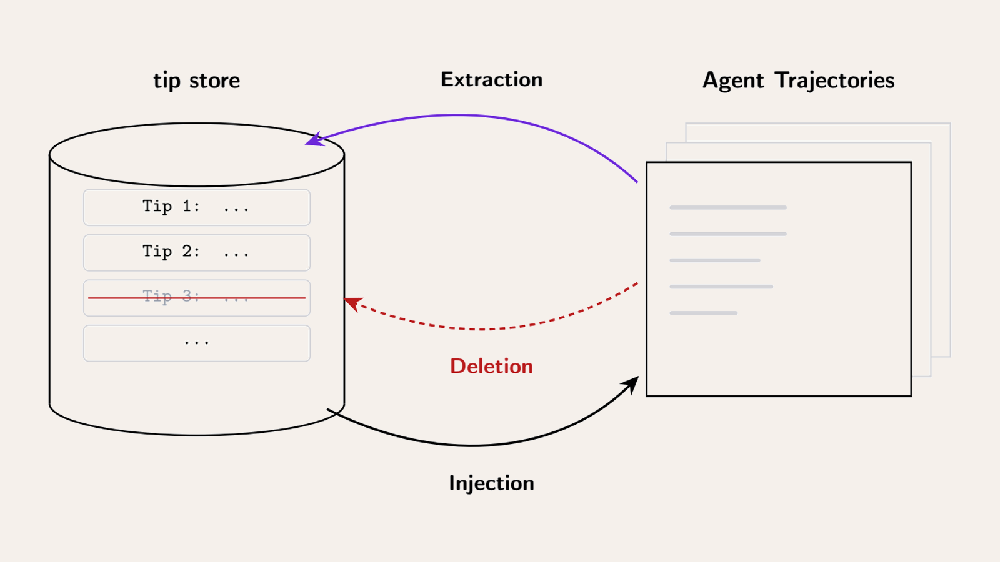
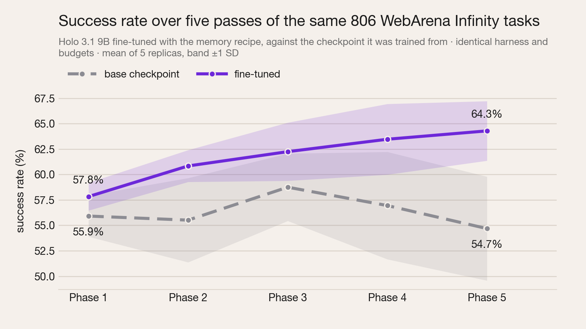

# Improving episodic memory in computer-use agents

Report and slides from my research internship at [H Company](https://www.hcompany.ai) (April to September 2026), on teaching computer-use agents to learn from their own past runs.

The work builds on H's open [Holo 3.1](https://huggingface.co/Hcompany) vision-language models for computer use. This repository holds the two public deliverables: the full report and the presentation. The implementation lives in H Company's codebase and is not part of this repository; the report describes every component in enough detail to reproduce the protocol.

| | |
|---|---|
| 📄 **Report** | [`episodic_memory_report.pdf`](episodic_memory_report.pdf), 40 pages |
| 🎞️ **Slides** | [view in the browser](https://raw.githack.com/alessandropranzo/cua-episodic-memory/main/episodic_memory_deck.html) · [`episodic_memory_deck.html`](episodic_memory_deck.html), 21 slides, self-contained |
| 🏢 **H Company** | [hcompany.ai](https://www.hcompany.ai) · [GitHub](https://github.com/hcompai) · [Hugging Face](https://huggingface.co/Hcompany) |
| 🤖 **Models used** | [Holo-3.1-9B](https://huggingface.co/Hcompany/Holo-3.1-9B) · [Holo-3.1-4B](https://huggingface.co/Hcompany/Holo-3.1-4B) |

## The problem

Computer-use agents are vision-language models that complete tasks by looking at a screen and acting on it: clicking, typing, scrolling, like a person would. Like most agents, they learn only during training. Once deployed, an agent that finds a good solution in one run has no way to remember it in the next.

The report opens with a small example of what that costs. The same policy, with the same weights and prompt, attempts one spreadsheet-cleaning task five times. One attempt discovers a formula that solves the task in 15 steps. The other four type row by row for 45 to 100 steps and fail. The procedure that works was available to all five; it was found once and thrown away.

## The idea

Give the agent an **episodic memory** it manages itself.

- **Tips are the unit of memory.** A tip is a short note in plain language that the agent writes while working, for example *"Clean text in LibreOffice Calc with `=PROPER(TRIM(cell))`"*. Tips live in a shared store indexed by [NextPlaid](https://github.com/lightonai/next-plaid), a multi-vector search engine, so retrieval is semantic and the store can grow incrementally.
- **Three operations.** *Injection* retrieves relevant tips into the agent's context, *extraction* writes a new tip, *deletion* removes a harmful one. For the trained policy these are ordinary tool calls, `search_tips`, `save_tip` and `delete_tip`, chosen like any other action. One retrieval is forced at the start of every task: a briefing of the eight most relevant tips.

<p align="center"></p>

## How learning is measured

A **five-phase protocol** replays the same set of tasks five times over one growing store. An agent that learns from experience must climb from Phase 1, where the store is empty, to Phase 5, in success rate and in steps per task. The task set is chosen so that there is something to learn on every task: the tasks a frozen policy solves in some of five independent runs but not all. That band holds 806 of the 2,527 tasks of [WebArena Infinity](https://github.com/web-arena-x/webarena-infinity) and 84 of the 331 tasks of [OSWorld](https://os-world.github.io/).

## How the policy is trained

An un-finetuned model given the memory tools almost never uses them: it writes a tip on about 2% of its runs, so there is no data to learn from. The recipe manufactures that data.


1. **Flywheel collection.** A two-model harness: the policy acts on the GUI while a second model, the *manager*, watches every step and decides whether to inject, create, delete or pass. The manager writes on 33.7% of runs, 18 to 40 times more than a policy left to itself.
2. **Scoring and filtering.** Every tip is scored by the outcome lift of the runs that received it. The rollouts worth imitating are shortlisted, and over-long failed rollouts are dropped: 38 of 321 shortlisted rollouts, yet 20.7% of the training examples, and the source of every tool-use pathology seen in an earlier round.
3. **Relabel and fine-tune.** The manager's decisions are rewritten as the policy's own tool calls, and Holo 3.1 9B and 4B are fine-tuned on the result. The policy learns a behaviour it never had, from rollouts it produced itself.

## Main result

<p align="center"></p>

**A 9B policy trained with the recipe gets better at the same tasks the more often it sees them, and the checkpoint it was trained from does not.** Same 806 WebArena Infinity tasks, same harness, same budgets, five replicas per arm:

| Arm | Success rate, Phase 1 → 5 | Mean steps per task, Phase 1 → 5 | Tips in the store at Phase 5 |
|---|---|---|---|
| **Holo 3.1 9B, fine-tuned** | **57.8% → 64.3%** | **29.5 → 26.4** | 166 |
| Holo 3.1 9B, base checkpoint | 55.9% → 54.7% | 31.9 → 33.1 | 25 |
| **Holo 3.1 4B, fine-tuned** | **34.7% → 38.4%** | **51.5 → 46.0** | 77 |
| Holo 3.1 4B, base checkpoint | 33.8% → 32.0% | 57.9 → 55.5 | 11 |

- **It is not memorisation.** The 9B gain is as large on tasks the model never trained on (+7.2 pp) and on three applications withheld entirely from training (+7.0 pp) as on the tasks it trained on (+6.3 pp). On those same unseen applications the base checkpoint falls from 51.0% to 44.7%.
- **It survives the strict count.** Counting every timed-out run as a failure, the 9B fine-tune solves 1,617 tasks at Phase 5 against 934 for its base, and 140 more than it solved itself at Phase 1.
- **The mechanism is visible.** Fine-tuning raises the write rate about four-fold (1.9% → 8.2% of runs at 9B), so the store actually fills. 77.7% of the tips the 9B writes carry positive outcome lift, and the best ones encode navigation procedures rather than instance values.

## What the result does not show

- It is a browser result. Only 6% of the training data is desktop (OSWorld), so the fine-tune is specialised to WebArena Infinity rather than to computer use in general.
- Deletion is never learned: two examples survived into 8,726 training turns, and the policy fires it once in 43,444 trajectories. Every store only grows.
- The 4B's gains do not survive the strict accounting on unseen applications; a size sweep would be needed to say whether that is a capacity effect.
- The retrieval budget (8 tips in the briefing, 5 per search) was fixed throughout and never tuned.

## Viewing the slides

`episodic_memory_deck.html` is a single self-contained file: every figure and animation is embedded, so it needs no server and no other files.

- **In the browser:** open the [hosted copy](https://raw.githack.com/alessandropranzo/cua-episodic-memory/main/episodic_memory_deck.html).
- **Locally:** download `episodic_memory_deck.html` (about 9 MB) and open it with any modern browser, for example by double-clicking it. Typefaces are fetched from Google Fonts when online and fall back to system fonts otherwise.
- **Navigating:** `→` / `Space` / `Page Down` advance, `←` goes back. Use the browser's full-screen mode to present.

## Reading the report

`episodic_memory_report.pdf` (September 2026, 40 pages) is the reference for everything above.

| Section | What it covers |
|---|---|
| 1 Introduction | The four kinds of agent memory and the motivating five-run example |
| 3 Episodic memory system | Tips, the store and the three operations |
| 4 Architectures | The flywheel (collection) and the policy (deployment) architectures |
| 5 Training recipe | Collection, tip scoring and filtering, supervised fine-tuning |
| 6 Evaluation protocol | Task selection and the five-phase setup |
| 7 Results | Phase curves, generalisation, tool use, tip quality |
| 8 Ablations | Flywheel design, the forced initial briefing, round 1 vs round 2 |
| 9 to 10 | Limitations, conclusion and future work |
| Appendices | Full rollouts of the motivating example, training curves, the six flywheel iterations, a conversion example, tip texts |

## Citation

```bibtex
@techreport{pranzo2026episodic,
  title       = {Improving episodic memory in computer-use agents},
  author      = {Pranzo, Alessandro},
  institution = {H Company},
  type        = {Internship report},
  year        = {2026},
  month       = sep,
  url         = {https://github.com/alessandropranzo/cua-episodic-memory}
}
```

## Acknowledgements

This work was carried out at [H Company](https://www.hcompany.ai) under the supervision of Tony Wu and Aurelien Lac, whose feedback shaped every iteration of it. Thanks to the whole H team for the opportunity, the infrastructure and the discussions. The evaluation uses [OSWorld](https://os-world.github.io/) and [WebArena Infinity](https://github.com/web-arena-x/webarena-infinity); the tip store runs on [NextPlaid](https://github.com/lightonai/next-plaid) by LightOn.
